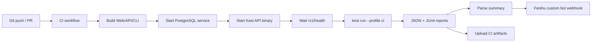

# Kest CLI 飞书机器人融合可行性报告

日期：2026-05-25

## 结论

可以做到，推荐路线不是把 Kest CLI 直接塞进飞书机器人进程里，而是让 CI/CD 负责构建和执行 Kest CLI，再由飞书机器人接收结果通知。

最小可落地版本是：

1. Git push 或 PR 触发 GitHub Actions。
2. CI 构建 API/Web/CLI。
3. CI 启动待测 API 和 PostgreSQL。
4. CI 执行 `kest run --profile ci`，生成 JSON/JUnit 报告。
5. CI 无论成功失败都调用飞书自定义机器人 Webhook，发送通过/失败、失败 flow、失败 step、耗时和构建链接。

这条路线不需要新增 Kest 后端功能，主要是新增 CI workflow、flow profile 和一个飞书通知脚本。若要在飞书里输入命令触发重跑、查询最近失败、审批后部署，则需要应用机器人 + 事件订阅 + 一个中转服务，属于第二阶段。

## 当前仓库现状

### 已经具备的能力

- `scripts/build.sh` 会先构建 Web，再构建 API，最后调用 `scripts/run-kest-flows.sh`。
- `scripts/build-api.sh` 会构建 API，最后调用 `scripts/run-kest-flows.sh`。
- `scripts/run-kest-flows.sh` 实际委托给 `scripts/api-test.sh`。
- `scripts/api-test.sh` 会检查 API 健康接口，随后执行 Kest CLI：
  - 如果设置了 `KEST_CLI_BIN`，使用指定 CLI。
  - 否则如果有 `cli/` 目录，执行 `cd cli && go run . run --profile "$PROFILE"`。
  - 否则使用系统里的 `kest run --profile "$PROFILE"`。
- Kest CLI 已支持 flow profile、批量扫描 `.flow.md`、JSON 报告和 JUnit 报告：
  - `.kest/flow.config.yaml`
  - `kest run --profile ci`
  - `--report-json`
  - `--report-junit`
- CLI 的退出码已经适合 CI：
  - `0` 成功
  - `1` 断言失败
  - `2` 运行时错误
  - `3` 配置错误

### 关键缺口

1. 构建脚本不会启动 API。

`scripts/build.sh` 和 `scripts/build-api.sh` 构建完成后直接跑 flow，但 `scripts/api-test.sh` 要求 `KEST_BASE_URL` 对应的 API 已经可访问。也就是说，在 CI 里必须先启动 PostgreSQL 和 API 进程，再跑 Kest flow。

2. 当前 profile 不会覆盖仓库里的所有 `.flow.md`。

仓库当前共有 30 个 `.flow.md`：

- 根目录 `.kest/flow`：1 个
- `api/.kest/flow`：25 个
- `cli/`：3 个
- `api/examples`：1 个

当前根目录 `.kest/flow.config.yaml` 的 `local` 和 `ci` profile 只包含：

```yaml
include:
  - ".kest/flow/**/*.flow.md"
```

这只会跑根目录 smoke flow，不会跑 `api/.kest/flow/**/*.flow.md`。如果目标是“所有 `.flow.md`”，需要显式扩展 include，或者按环境拆 profile。

3. 不是所有 `.flow.md` 都适合每次 push 后跑。

`api/.kest/flow` 里有生产回归、线上 discovery、debug 等 flow，部分使用 `https://api.kest.dev` 或线上路径。它们不应该默认在每次 push 的本地 CI 里执行，否则会污染线上数据、受外部网络波动影响，也可能需要额外凭据。

## 推荐架构



## 推荐分层

### 第一层：CI 通知型机器人

适合现在立即做。

能力：

- push 后自动构建。
- 构建后跑指定 flow 集合。
- 失败时飞书通知。
- 成功时可配置是否通知。
- 通知里带 GitHub Actions 链接、commit、分支、总 flow 数、失败 flow 数、失败 step 摘要。

实现成本低，风险小，不需要新增 Kest API 表结构。

### 第二层：飞书 ChatOps 机器人

适合后续做。

能力：

- 在飞书里发送“重跑失败 flow”。
- 在飞书卡片按钮里触发 `workflow_dispatch`。
- 查询最近一次 CI 结果。
- 按 workspace、branch、profile 选择运行范围。

需要：

- 飞书应用机器人，不只是自定义机器人。
- 一个 HTTPS 中转服务，用于接收飞书事件、校验签名、调用 GitHub Actions API 或内部 runner。
- 权限模型和审计。

### 第三层：Kest workspace 原生集成

适合产品化。

能力：

- 在 Kest Web 里配置飞书机器人。
- workspace 级别配置通知策略、profile、分支、失败阈值。
- flow 运行结果进入 Kest 后端，并在 Web/飞书双向查看。

这需要新增后端集成配置、密钥加密存储、运行记录和 UI 配置页，工作量明显大于 CI 通知型方案。

## Flow profile 建议

不要把“所有 `.flow.md`”直接作为唯一标准。建议拆成三个 profile：

### `ci`

每次 push / PR 都跑。只覆盖稳定、可在临时数据库上执行的本地 API flow。

建议 include：

```yaml
include:
  - ".kest/flow/**/*.flow.md"
  - "api/.kest/flow/**/*.flow.md"
exclude:
  - "api/.kest/flow/production-*.flow.md"
  - "api/.kest/flow/test-production-api.flow.md"
  - "api/.kest/flow/test-api.kest.dev.flow.md"
  - "api/.kest/flow/production-api-discovery.flow.md"
```

### `ci-smoke`

每次提交都跑，速度最快：

```yaml
include:
  - ".kest/flow/local-smoke.flow.md"
  - "api/.kest/flow/00-smoke-test.flow.md"
  - "api/.kest/flow/99-working-smoke-test.flow.md"
```

### `production-regression`

部署后或定时跑，目标是线上/预发环境。必须单独配置凭据、测试账号、数据清理策略和更严格的通知。

## GitHub Actions 落地示例

下面是建议的 CI 结构，实际路径和 profile 可按最终策略收敛：

```yaml
name: Kest Flow CI

on:
  push:
    branches: [main]
    paths:
      - "api/**"
      - "cli/**"
      - ".kest/**"
      - "scripts/**"
      - ".github/workflows/kest-flow-ci.yml"
  pull_request:
    paths:
      - "api/**"
      - "cli/**"
      - ".kest/**"
      - "scripts/**"
      - ".github/workflows/kest-flow-ci.yml"

jobs:
  kest-flow:
    runs-on: ubuntu-latest
    services:
      postgres:
        image: postgres:14-alpine
        env:
          POSTGRES_DB: kest
          POSTGRES_USER: kest_user
          POSTGRES_PASSWORD: kest_password_123
        ports:
          - 5432:5432
        options: >-
          --health-cmd "pg_isready -U kest_user -d kest"
          --health-interval 10s
          --health-timeout 5s
          --health-retries 5

    env:
      PORT: 8025
      GIN_MODE: release
      DB_HOST: 127.0.0.1
      DB_PORT: 5432
      DB_NAME: kest
      DB_USERNAME: kest_user
      DB_PASSWORD: kest_password_123
      JWT_SECRET: ci_jwt_secret_min_32_chars_change_me
      KEST_BASE_URL: http://127.0.0.1:8025
      KEST_PROFILE: ci

    steps:
      - uses: actions/checkout@v4

      - uses: actions/setup-go@v5
        with:
          go-version: "1.24.x"
          cache-dependency-path: |
            go.sum
            api/go.sum
            cli/go.sum

      - name: Check workspace terminology
        run: node scripts/check-workspace-terminology.mjs

      - name: Build Kest CLI
        run: |
          mkdir -p .bin
          cd cli
          go build -o ../.bin/kest .

      - name: Build API
        run: |
          cd api
          go mod download
          CGO_ENABLED=0 go build -ldflags="-s -w" -o ../.bin/kest-api ./cmd/api

      - name: Start API
        run: |
          ./.bin/kest-api > api.log 2>&1 &
          echo $! > api.pid
          for i in {1..60}; do
            curl --fail --silent "$KEST_BASE_URL/v1/health" && exit 0
            sleep 1
          done
          cat api.log
          exit 1

      - name: Run Kest flows
        id: kest
        continue-on-error: true
        env:
          KEST_CLI_BIN: ${{ github.workspace }}/.bin/kest
        run: |
          mkdir -p .kest/reports
          scripts/run-kest-flows.sh

      - name: Upload Kest reports
        if: always()
        uses: actions/upload-artifact@v4
        with:
          name: kest-flow-reports
          path: |
            .kest/reports/flow-results.json
            .kest/reports/flow-results.xml
            api.log

      - name: Notify Feishu
        if: always()
        env:
          FEISHU_WEBHOOK: ${{ secrets.FEISHU_WEBHOOK }}
          FEISHU_SECRET: ${{ secrets.FEISHU_SECRET }}
          KEST_RESULT: ${{ steps.kest.outcome }}
        run: |
          scripts/notify-feishu-kest.sh .kest/reports/flow-results.json

      - name: Fail workflow when Kest failed
        if: steps.kest.outcome != 'success'
        run: exit 1
```

说明：

- `continue-on-error: true` 是为了确保失败时仍能上传报告并发送飞书通知。
- 最后单独 `exit 1`，保证 GitHub Check 状态仍然失败。
- `FEISHU_WEBHOOK` 和 `FEISHU_SECRET` 放 GitHub Secrets。

## 飞书通知实现建议

飞书自定义机器人适合做结果推送。官方文档说明它通过 Webhook 地址推送消息，并支持多种消息类型和安全设置。CI 场景建议优先用签名校验，不建议依赖 IP 白名单，因为 GitHub-hosted runner 出口 IP 不稳定。

通知内容建议：

- 标题：`Kest Flow CI passed/failed`
- 仓库、分支、commit、触发人
- profile、base URL
- flow 总数、通过数、失败数
- step 总数、失败 step 数
- 耗时
- 失败 flow Top N
- GitHub Actions run 链接
- artifact 名称或报告链接

简单文本消息可以先落地；后续再升级为消息卡片。

### 失败通知示例

```text
Kest Flow CI failed
Repo: kest2
Branch: main
Commit: abc1234
Profile: ci
Flows: 23 total, 21 passed, 2 failed
Steps: 184 total, 3 failed
Failed:
- 12-apispec-complete.flow.md: 1 failed step
- 18-flow-complete.flow.md: 2 failed steps
Run: https://github.com/org/repo/actions/runs/...
```

## 是否需要改 Kest CLI

MVP 不需要改 CLI。

现有 CLI 已经具备：

- profile 选择
- include/exclude
- JSON/JUnit 报告
- CI 退出码
- flow 同步能力

建议新增的不是 CLI 核心能力，而是外围脚本：

- `scripts/kest-ci-run.sh`：统一 build/start/wait/run/report。
- `scripts/notify-feishu-kest.sh`：读取 JSON 报告并发飞书。

如果要提升体验，可以后续给 CLI 增加一个专门的聚合输出：

```bash
kest run --profile ci --summary-json .kest/reports/summary.json
```

但目前 `flow-results.json` 已足够通知使用。

## 主要风险和处理方式

### 1. 测试范围失控

风险：直接跑所有 `.flow.md` 会包含生产、debug、示例和 CLI 自测文件。

处理：按 profile 分层；默认 CI 排除生产和 discovery flow。

### 2. API 未启动导致构建后测试失败

风险：现有 build 脚本构建后直接测试，但没有启动 API。

处理：CI workflow 明确启动 API，并等待 `/v1/health` 成功。

### 3. 数据污染和幂等性

风险：flow 会注册用户、创建 workspace 相关资源、修改密码、删除账号。

处理：CI 使用临时 PostgreSQL；生产 profile 必须使用专用测试账号、唯一前缀和清理步骤。

### 4. 性能断言不稳定

风险：部分 flow 有 `duration < 500ms`、`duration < 1000ms` 这类断言，CI 环境可能抖动。

处理：把性能 flow 单独拆为 `performance` profile，或放宽 CI 阈值。

### 5. 敏感信息泄露

风险：HTML/log 报告可能包含请求头、请求体或响应体。

处理：飞书通知只发送聚合结果和失败摘要；artifact 权限依赖 CI 平台；生产凭据只放 Secrets。

### 6. 飞书安全策略

风险：裸 Webhook 泄露后可能被滥发。

处理：启用签名校验；必要时加关键词；不要把 Webhook 写进仓库。

### 7. 执行时间

风险：现有 flow document 顺序执行；大量 flow 每次 push 都跑会拖慢反馈。

处理：先跑 `ci-smoke`，main 分支跑 `ci`，部署后跑 `production-regression`。

## 实施计划

### 第 1 步：整理 flow profile

- 更新 `.kest/flow.config.yaml`。
- 增加 `ci-smoke`、`ci`、`production-regression`。
- 明确生产 flow 不进入默认 CI。

### 第 2 步：新增 CI 运行脚本

脚本职责：

- 构建 CLI。
- 构建 API。
- 启动 API。
- 等待健康检查。
- 运行 `scripts/run-kest-flows.sh`。
- 保证报告目录存在。

### 第 3 步：新增飞书通知脚本

脚本职责：

- 读取 `.kest/reports/flow-results.json`。
- 生成文本或消息卡片 payload。
- 按飞书安全设置生成签名。
- POST 到 `FEISHU_WEBHOOK`。

### 第 4 步：新增 GitHub Actions workflow

- push/PR 触发。
- PostgreSQL service container。
- 上传 JSON/JUnit artifact。
- `always()` 通知飞书。
- Kest 失败时最终 workflow 失败。

### 第 5 步：试运行和校准

- 先跑 `ci-smoke`。
- 再扩到 `ci`。
- 观察失败点：端口、迁移、seed、性能阈值、数据依赖。
- 稳定后启用 main 分支通知。

## 预估工作量

MVP：

- flow profile 调整：0.5 天
- CI workflow：0.5 天
- 飞书通知脚本：0.5 天
- 试运行和修复 flaky flow：1 到 2 天

合计：2 到 4 天。

ChatOps 第二阶段：

- 飞书应用机器人和事件订阅：1 到 2 天
- 中转服务和 GitHub Actions API 调用：2 到 4 天
- 权限、安全、审计和卡片交互：2 到 5 天

合计：1 到 2 周。

## 最终建议

先做 CI 通知型机器人。它已经能满足“推送新代码之后构建，构建之后跑一遍 flow，通过或不通过都让飞书通知”的核心目标，且和现有 Kest CLI 能力高度匹配。

不要一开始做完整飞书交互式机器人。等 CI 通知稳定后，再把“飞书里重跑失败 flow”和“查询最近结果”作为第二阶段。

## 参考

- 飞书开放平台：自定义机器人使用指南  
  https://open.feishu.cn/document/client-docs/bot-v3/add-custom-bot
- GitHub Actions workflow 语法  
  https://docs.github.com/en/actions/reference/workflows-and-actions/workflow-syntax
- GitHub Actions PostgreSQL service container  
  https://docs.github.com/en/actions/tutorials/use-containerized-services/create-postgresql-service-containers
- GitHub Actions artifacts  
  https://docs.github.com/en/actions/tutorials/store-and-share-data
