# Product Flow Audit

Date: 2026-04-11

Scope:
- Auth entry
- Project dashboard
- Project overview
- Collections
- API Specs
- Environments
- Categories
- Test Cases
- Console settings
- Direct placeholder routes for History and Flows

Principles used in this audit:
- Every page should answer one primary user question.
- A project route should expose a predictable hierarchy.
- Incomplete modules should not compete with production-ready modules in first-line navigation.
- Empty states should offer the next action, not just describe absence.

## Current primary flow

1. Sign in or register.
2. Open `/project` to choose a project.
3. Open `/project/:id` to review project scope and choose the next module.
4. Enter one of the working modules:
   - API Specs with AI Draft
   - Collections
   - Environments
   - Categories
   - Test Cases
5. Keep CLI Sync on the project overview as the platform-to-local bridge.

## AI-first path

The product is strongest when it behaves like this:

1. Describe an endpoint in natural language.
2. Let AI produce a project-aware API Spec draft.
3. Review and accept the spec.
4. Configure environments only when execution needs real targets.
5. Generate and maintain test cases from the accepted spec.

This means:
- API Specs should be the first module in project navigation.
- AI Draft should be the primary CTA in both project overview and API Specs.
- Test Cases should sit close to API Specs in navigation because they are downstream of the same source of truth.
- Collections remain useful, but as a debugging surface rather than the first destination.

## Page-by-page review

### 1. Login

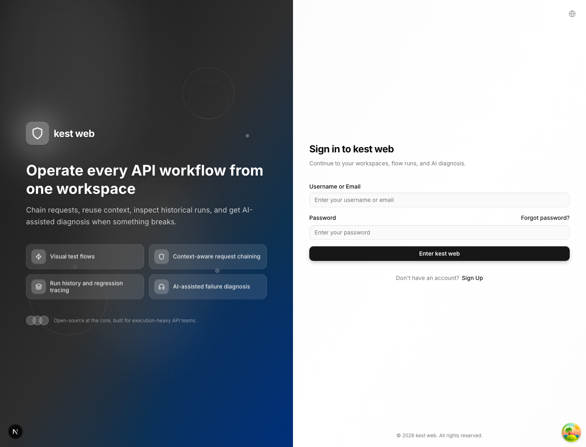

Primary job:
- Get a user into the system quickly.

Assessment:
- The layout is already clean and product-grade.
- The split hero + form pattern works.
- No structural change needed in this pass.

### 2. Project Dashboard

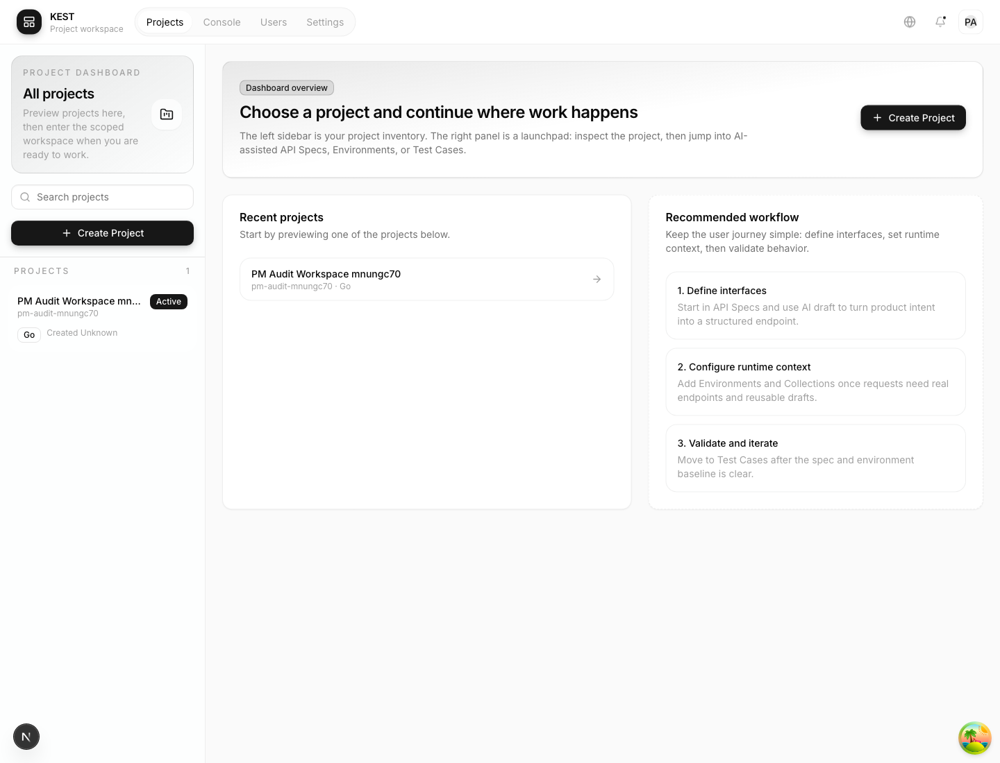

Primary job:
- Let the user choose a project and understand the platform workflow in one screen.

Issues found:
- The old copy explained implementation mechanics instead of user intent.
- The page over-explained sidebar architecture.

Optimization shipped:
- Reframed the page as a launchpad.
- Replaced IA-heavy copy with a three-step product workflow:
  - Define interfaces
  - Configure runtime context
  - Validate and iterate

### 3. Project Overview

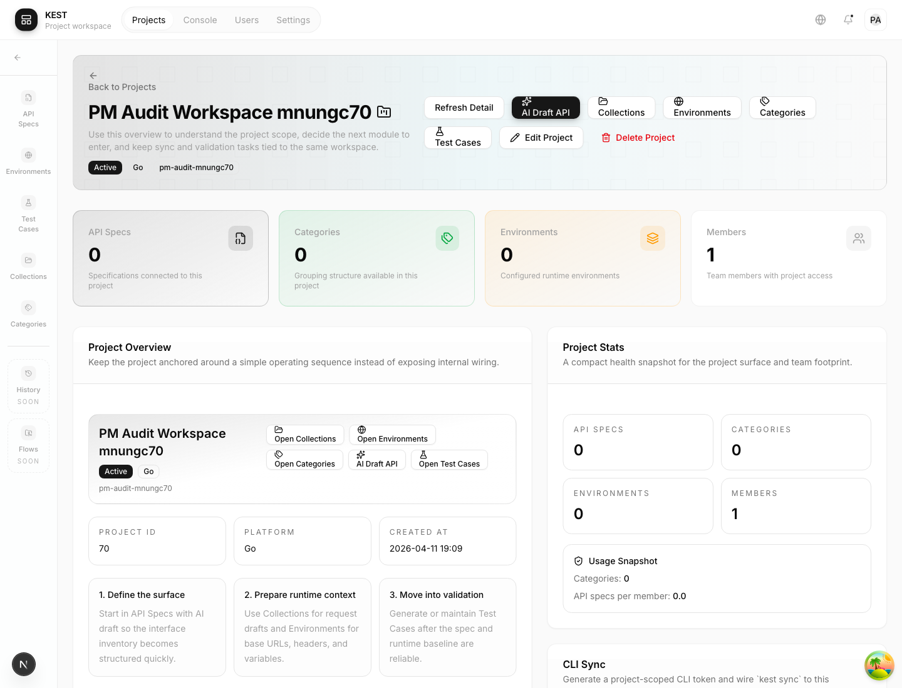

Primary job:
- Act as the default home of a project.
- Provide the shortest path to the next module.

Issues found:
- `/project/:id` previously redirected straight into API Specs.
- The real project overview was hidden behind `?mode=details`.
- That made breadcrumbs and "Open Project" semantically wrong.

Optimization shipped:
- `/project/:id` now resolves to the project overview by default.
- The overview explains the working sequence instead of backend endpoints.
- Entry points to API Specs, Collections, Environments, Categories, and Test Cases are visible in one place.

### 4. API Specs

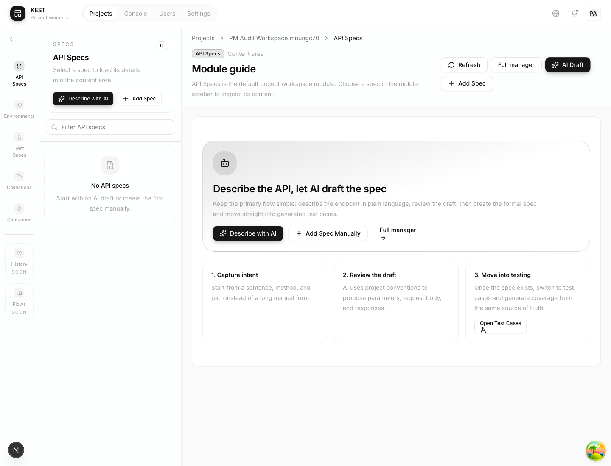

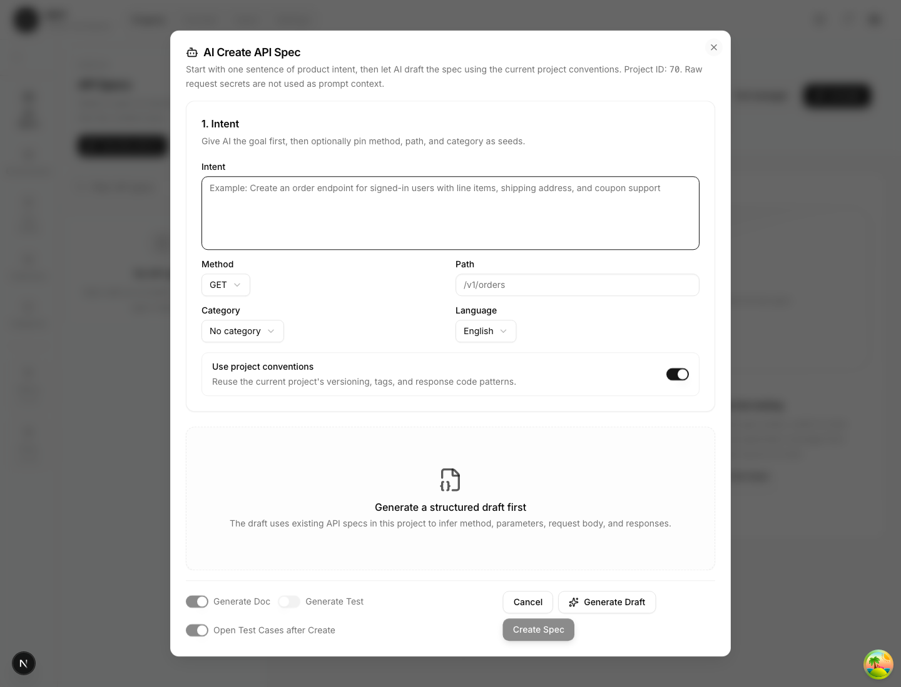

Primary job:
- Hold the interface source of truth.

Assessment:
- This is the best candidate to remain the core module.
- The new guide state is understandable, but the page still feels empty before the first spec exists.

Recommended next step:
- Add a first-run creation path directly in the workspace content area that mirrors the full manager entry.
- Offer `Create spec`, `Import spec`, and `AI draft` as parallel choices.

### 5. Collections

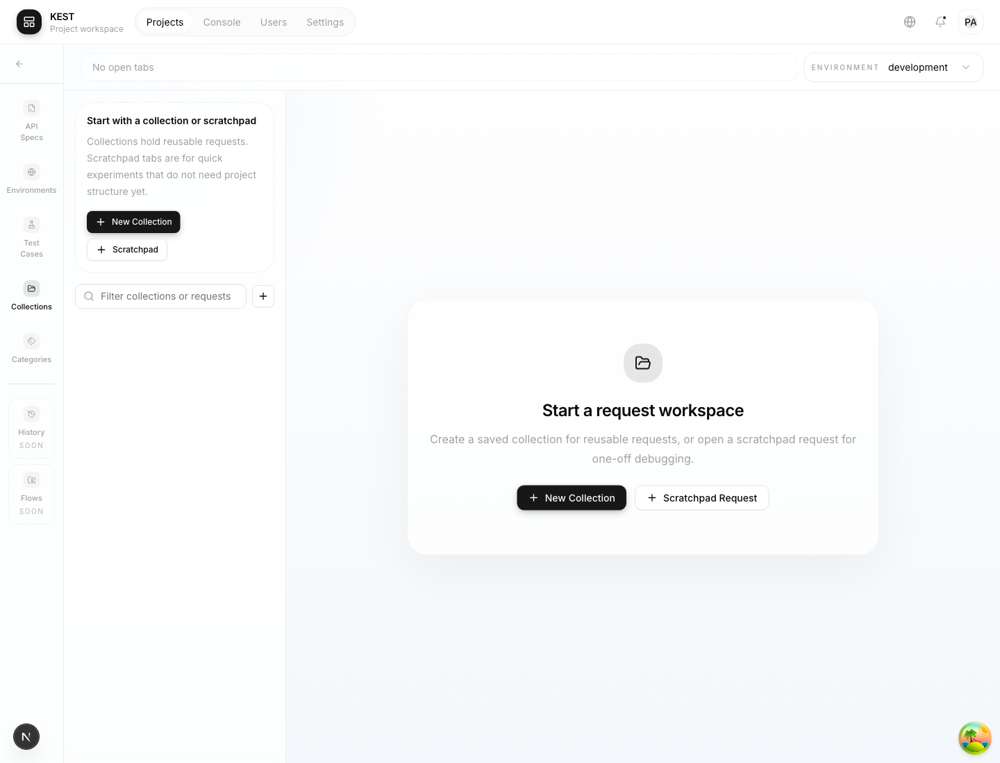

Primary job:
- Support request drafting and ad hoc execution.

Issues found:
- This was the noisiest page in the product.
- The old empty state was a large blank canvas with mixed-language copy.
- There was no obvious first action for new users.

Optimization shipped:
- Added a first-run onboarding card in the sidebar.
- Added a main empty state with two explicit actions:
  - New Collection
  - Scratchpad Request
- Removed the mixed-language empty tab label.

Recommended next step:
- Add a lightweight project-scoped intro header so Collections explains when to use it versus API Specs.

### 6. Environments

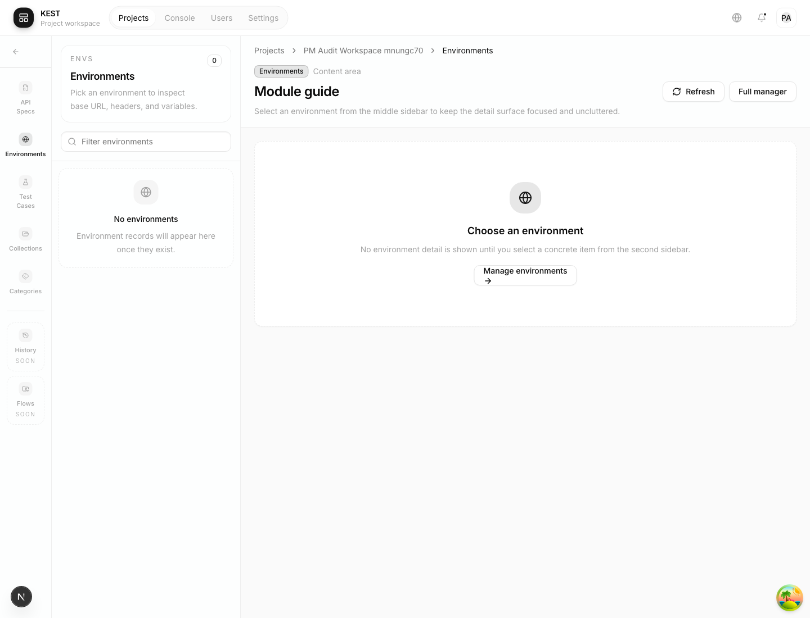

Primary job:
- Manage runtime targets, variables, and headers.

Assessment:
- The two-column workspace is workable.
- The guide state is clear.
- This page is structurally sound, but the empty-state CTA still routes to the legacy full manager.

Recommended next step:
- Inline basic environment creation in the workspace instead of forcing a mode switch.

### 7. Categories

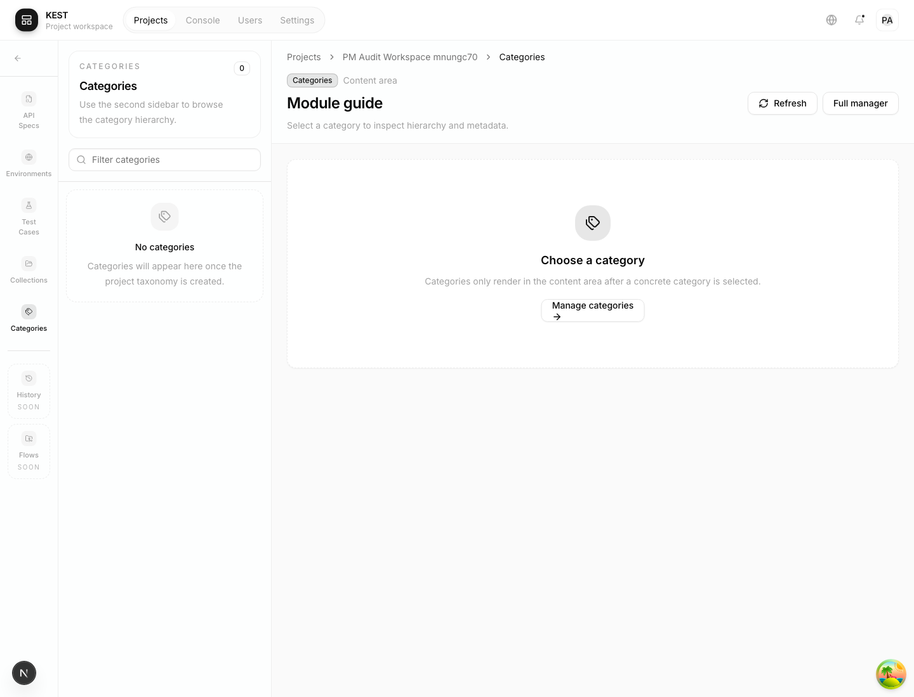

Primary job:
- Organize growing project assets.

Assessment:
- The structure is acceptable.
- The module should remain secondary for smaller projects.

Recommended next step:
- De-emphasize categories for empty projects and surface them later, after API Specs exist.

### 8. Test Cases

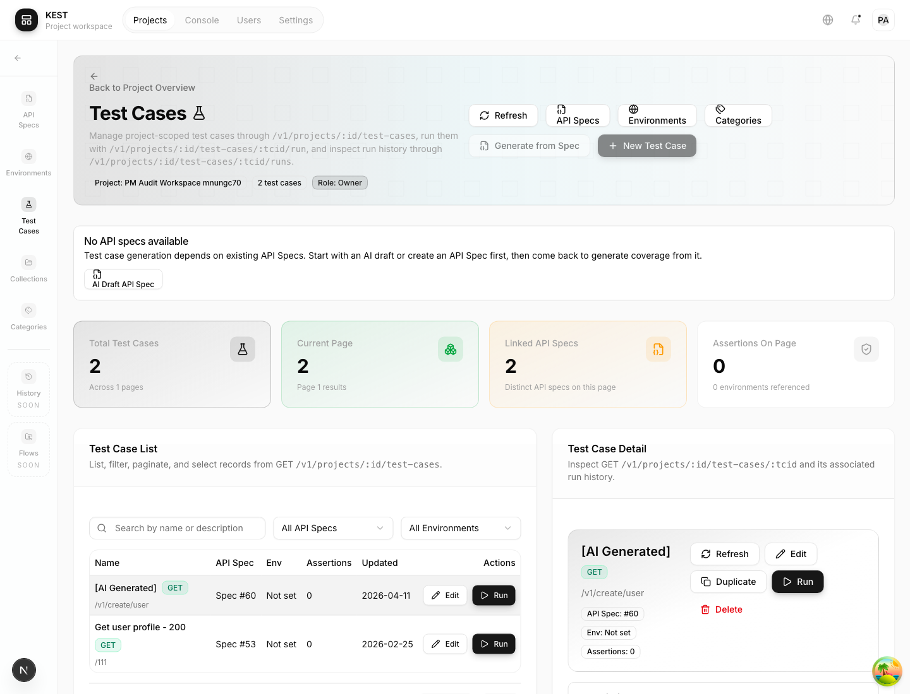

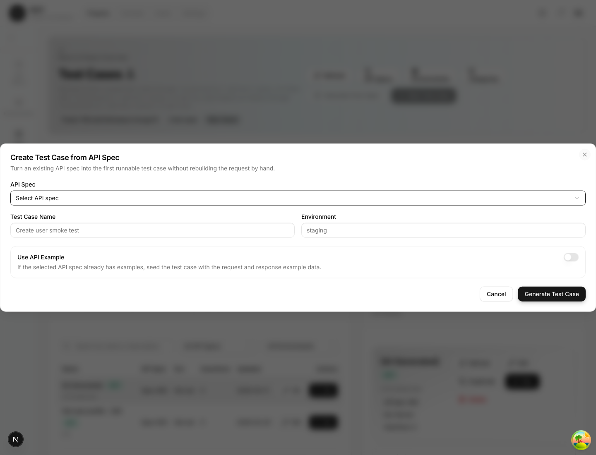

Primary job:
- Move the project from definition into verification.

Assessment:
- This page already feels like a real operational surface.
- It should become the end of the primary setup path, not a side module.

Recommended next step:
- Tie it more explicitly to API Specs coverage and generated suites.

### 9. Console Settings

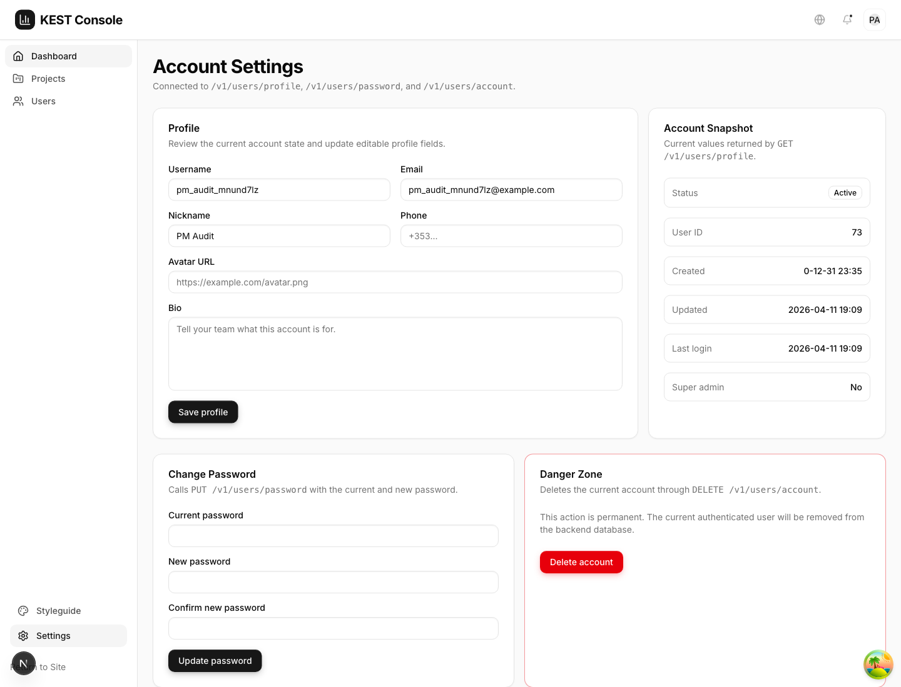

Primary job:
- User-level account management.

Assessment:
- Clear and functional.
- No major IA changes required for the product flow audit.

### 10. History and Flows

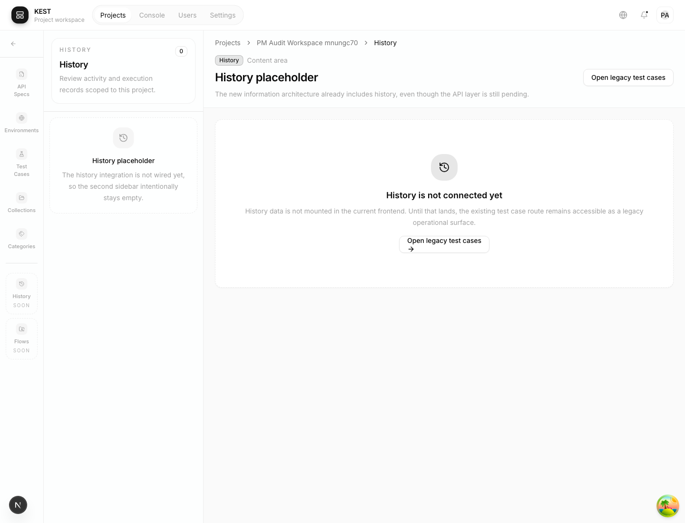

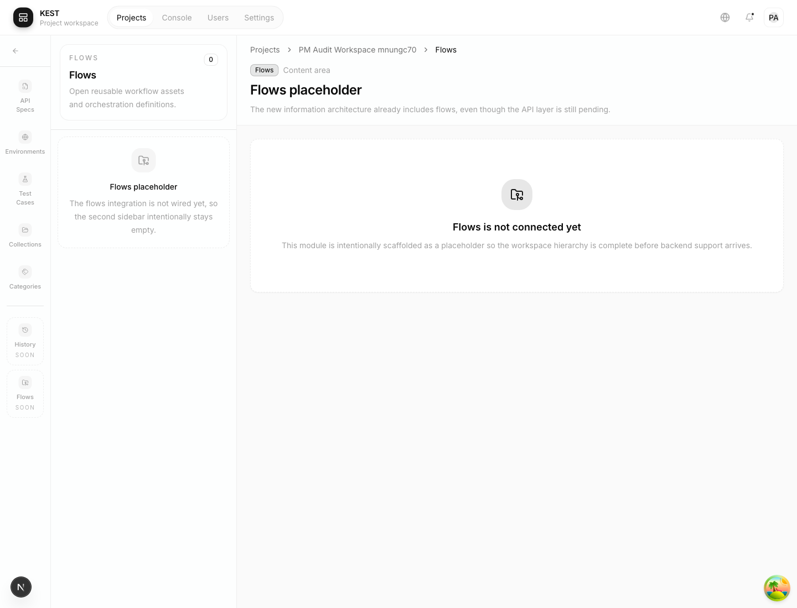

Primary job:
- History should eventually show execution records.
- Flows should eventually hold cross-endpoint story orchestration.

Issues found:
- They were exposed as if they were production-ready modules.
- In practice they are placeholder surfaces.

Optimization shipped:
- They remain reachable by direct URL for internal development.
- They are no longer treated as first-line workspace navigation.
- The sidebar now marks them as `Soon` instead of presenting them as equal peers.

## Changes shipped in this pass

- Restored `/project/:id` as the default project overview route.
- Changed workspace back navigation to return to the project overview instead of ejecting users to the project list.
- Downgraded History and Flows to `Soon` status in the workspace sidebar.
- Rewrote the project dashboard and project overview copy to be user-task oriented instead of implementation oriented.
- Added explicit first-run onboarding to Collections.
- Reordered the workspace navigation to an AI-first flow: API Specs, Environments, Test Cases, Collections, Categories.
- Added direct AI Draft entry points from project overview, project dashboard, and API Specs.
- Added an AI-first guide state to the API Specs workspace so empty projects no longer dead-end on a passive placeholder.
- Removed page-level mixed-language copy from the main user flow so login, AI Draft, generated test case setup, and Collections now read consistently in English.

## Remaining product issues

1. API Specs still needs an in-workspace first-run path, not only a guide state plus full-manager escape hatch.
2. Environments and Categories still lean on `?mode=manage` for real CRUD flows.
3. Test Cases should be framed as coverage generated from API Specs, not just as a separate management screen.
4. Collections still needs clearer guidance on when it is the right surface versus API Specs.
5. History and Flows should stay out of primary navigation until they have real end-to-end value.

## Recommended next implementation order

1. Make API Specs first-run capable inside the workspace.
2. Add in-place creation for Environments.
3. Reframe Test Cases around generated use-case suites from API Specs.
4. Productize History as run history after CLI and local-runner ingestion are ready.
5. Reintroduce Flows only when cross-endpoint use stories are truly executable.
